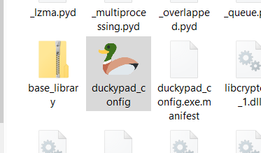
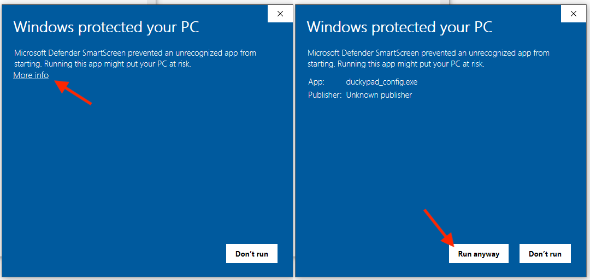
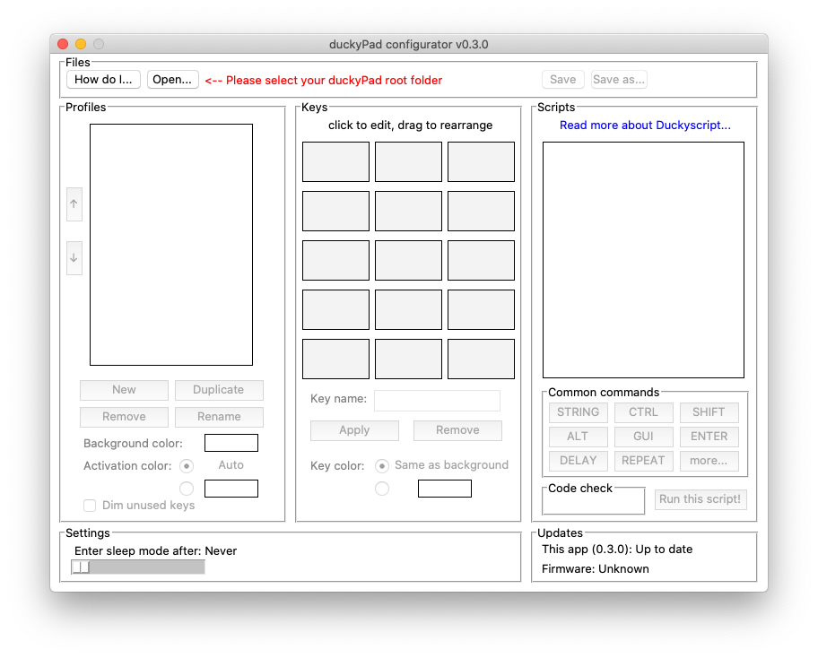
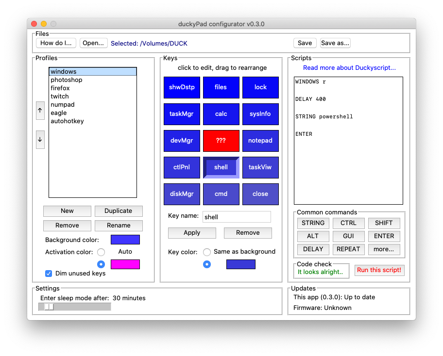
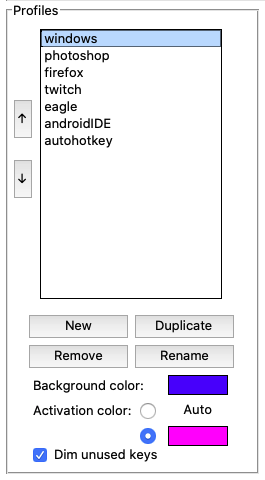
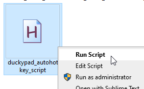
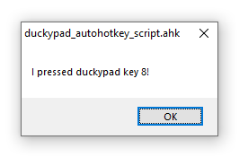
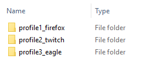
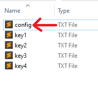

# Getting Started with duckyPad

[Main Page](/README.md) | [Buy duckyPad](/purchase_information.md)

------

Congratulations on your new toy! Here is a short guide on how to use your duckyPad.

## Kit Assembly

If your duckyPad has not been assembled yet, [see this guide](/kit_assembly_guide.md) to put it together.

## Quick Start

Your duckyPad should come with a SD card already installed, containing some demo profiles.

Simply plug it into your computer, and voilà:


* Use `+` and `-` button to switch profiles.

* Press a key to execute the corresponding script. Hold it down to repeat.

## Customizing Your Own Scripts

Chances are you want to write your own scripts. So here's how! 

### Notes on SD Card

To remove the SD card, push inwards to unlock.

To install the SD card, insert logo side up, push until it clicks in place:


If you decide to use your own SD card, it should be formatted in [FAT32 format](resources/pics/format.PNG).

### Download the duckyPad configurator

[Head here to download the latest release](https://github.com/dekuNukem/duckyPad/releases) for Windows, macOS, and Linux.

* The software is in early stages of development. If you run into any problems, please don't hesitate to [open an issue](https://github.com/dekuNukem/duckypad/issues), DM me on discord `dekuNukem#6998`, ask in the [official duckyPad discord](https://discord.gg/4sJCBx5), or contact me through `dekuNukem`@`gmail`.`com`.


Extract the `.zip` file and launch the application by clicking `duckypad_config.exe`:



For Linux users, simply run the `duckypad_config.py` script with Python3.6 or higher. 

### "Untrusted App" Warnings

When trying to run the app, your system might complain about this software being untrusted. This is because I haven't had the code digitally signed, which costs hundreds of dollars a year.

Please feel free to [review the code](https://github.com/dekuNukem/duckyPad/tree/master/pc_software). If you really don't trust the app, you can run the `duckypad_config.py` script itself with Python3. Finally, you can [configure your duckyPad completely manually](#Configure-duckyPad-Manually).

For Windows 10, click `More info` and then `Run anyway`.



For macOS, **`RIGHT CLICK`** on the app and select `Open`:


### Using the duckyPad configurator

Mount the SD card on your computer and launch the app. It should look like this:



Press the `Open...` button, and select the **`entire SD card`**:


The application should load up the data from the SD card:



-----

It might look a bit overwhelming, but don't worry, let's break it down.

* The leftmost column is for *profiles*.

* Each profile contains a group of scripts corresponding to the keys on the duckyPad.

* As you can see, you typically create a profile for each app you want to control.



* Use the buttons to create a new profile, duplicate an existing profile, and remove/rename a profile.

* Use the up/down arrow button to reorder profiles.

* Choose a background color for the RGB backlight.

* `Activation color` is the color that a key change into when you press it. On `Auto` it would be the inverse of background color, you can also choose one yourself.

* By default unused keys are dimmed, you can override this by unticking the checkbox.

-----

The middle column is for *keys*:


* Here you can configure the 15 keys on your duckyPad.

* Click a key to select it.

* Type to give it a name, or click `Remove` to delete it.

* You can assign an unique color to each key, or use the same color as background.

* Drag a key to rearrange its order.

-----

Finally, the rightmost column is for *scripts*:


* Once you have selected a key, the script that this key will execute is displayed here.

* duckyPad uses duckyScript, you can [read about its usage here](https://github.com/hak5darren/USB-Rubber-Ducky/wiki/Duckyscript).

* Code check will be performed as you type, errors will be highlighted in yellow.

* You can also use an external editor and just paste the code in.

-----

One the bottom we have settings and updates section.


By default, duckyPad goes to sleep after 30 minutes. Adjust the slider to set your own delay. Drag it all the way to the left for always-on.

`Updates` section shows you available updates for this app and duckyPad firmware. Click on the text for instructions.

-----

Don't forget to save!


* Press the `Save` button to save the changes to SD card. It might take a few seconds.

* You can also press `Save as...` to make a backup somewhere else, select a empty folder first!

### Run it!

Eject the SD card from your computer, insert it into duckyPad, plug it in. It should start up and display the profile names and key names, as well as the customized colors.

Press the corresponding keys to execute the scripts, if there is an error it will show up on the screen.

Press +/- button to change profiles.

## Using Autohotkey

You can use [autohotkey](https://www.autohotkey.com) for even more sophisticated scripting needs, such as launching apps/scripts, control mouse moments, etc.

To do this, duckyPad can be set up to press a simple combo like `WIN + F1`, which then get captured by autohotkey to execute a more complex custom script on your PC.

* Download and install [autohotkey](https://www.autohotkey.com)

* Download and save [this sample autohotkey script](https://raw.githubusercontent.com/dekuNukem/duckyPad/master/resources/duckypad_autohotkey_script.ahk) as an `.ahk` file.

* Switch the profile on duckyPad to [`autohotkey`](sample_profiles/profile7_autohotkey), and run the script by right clicking and select `Run Script`.



* AHK will execute the script. Press any key on duckyPad, a corresponding message box will appear.



* Now you can write your own autohotkey script to do whatever you want!

Check out the [official tutorials](https://www.autohotkey.com/docs_1.0/Tutorial.htm), the [autohotkey profile](sample_profiles/profile7_autohotkey), and the [sample autohotkey script](resources/duckypad_autohotkey_script.ahk) upon which you can tinker with. 

## USB Firmware Updates

You can update duckyPad's firmware via USB, for bug fixes and and/or new features. 

[Please see this guide](./firmware_updates_and_version_history.md).

## Configure duckyPad Manually

If you don't trust or unable to run the software, you can also configure duckyPad manually with a text editor.

### Step 1: Preparing Profiles

A *Profile* contains a group of scripts corresponding to the keys on the duckyPad. Usually you want to set up one profile per program you want to control.

Profiles are created as folders at the **root level** of the SD card. They have naming conventions like `profile#_name`, where `#` is the profile number, and `name` being the name of the profile.

If you mount the SD card on your computer, you might see some examples like these:



[Existing examples](https://github.com/dekuNukem/duckypad/raw/master/sample_profiles.zip) are an excellent starting point of making your own profiles and scripts.

Up to 16 profiles are supported.

### Step 2: Preparing Scripts

Now you're ready to write some scripts inside the profile folders. The script used in this project is Duckyscript, [click here to read its usage](https://github.com/hak5darren/USB-Rubber-Ducky/wiki/Duckyscript).

Each key has its own script file, named like `key#.txt`, where `#` is the key number(top left is 1, bottom right is 15). 

Here are some examples:


* Might be helpful to take a look at the [sample profiles](https://github.com/dekuNukem/duckypad/raw/master/sample_profiles.zip) before writing your own

### Step 3: Key Names and Optional Parameters

Create a file named `config.txt` in a profile folder like this:



#### Key Names

In the `config.txt`, list the names of your keys like this:

```
z1 prev
z2 next
z3 close
z4 reopen
....
z15 save
```
* The screen will only display the **first 7 characters** of the key name, so keep it short!

#### Backlight Colors

To set your custom background color, add the following line:

```
BG_COLOR 255 100 0
```

The number should be between 0 and 255, in the order of R-G-B.

* Can't decide? Use [this website](https://www.w3schools.com/colors/colors_picker.asp) to try some out. Use the `rgb()` value of each colour.

If unspecified, the default background color would be light purple.

#### Key-down Colors

To set the color of a key to change into when pressed, add the following line in `config.txt`:

```
KEYDOWN_COLOR 100 0 255
```

If unspecified, the default key-down color would be the inverse of background color.

#### Dim Unused Keys

By default unused keys are dimmed. If you want everything to light up, add the following line in `config.txt`:

```
DIM_UNUSED_KEYS 0
```

#### Individual Key Colors

You can also assign colors to individual keys, this will override the background color above.

Just add lines in `config.txt` for the keys you want like this:

```
SWCOLOR_1 148 0 211
SWCOLOR_2 148 0 211
SWCOLOR_3 148 0 211
SWCOLOR_4 0 0 255
SWCOLOR_5 0 0 255
SWCOLOR_6 0 0 255
SWCOLOR_7 0 255 0
SWCOLOR_8 0 255 0
SWCOLOR_9 0 255 0
SWCOLOR_10 255 255 0
SWCOLOR_11 255 255 0
SWCOLOR_12 255 255 0
SWCOLOR_13 255 0  0
SWCOLOR_14 255 0  0
SWCOLOR_15 255 0  0
```

### Step 4: Run it!

Just like before, make sure the SD card is in FAT32 format, copy all the profile folders to the root of the SD card (if they are not already there), insert it in your duckyPad, and power on.

duckyPad should start up and display the profile names and key names, as well as the background color.

Press the corresponding keys to execute the scripts, if there is an error it will show up on the screen.

Press +/- button to change profiles.

## Questions or Comments?

Please feel free to [open an issue](https://github.com/dekuNukem/duckypad/issues), ask in the [official duckyPad discord](https://discord.gg/4sJCBx5), DM me on discord `dekuNukem#6998`, or email `dekuNukem`@`gmail`.`com` for inquires.


