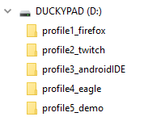
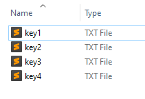

# Getting Started with kbord

Congratulations on the purchase! Here is a short guide on how to use it.

## Quick start

You need a micro SD card to store the script from which kbord will execute. Any old ones below 8GB would be plenty.

Formate it in FAT32:


Afterwards, [Click here](sample_SD_card.zip) to download some sample profiles. Extract everything into the root of SD card like this:



Eject the SD card and put it in kbord, turn the power on, and voilà:


Press a key to execute the corresponding script, and use `+` and `-` button to switch profiles.

## Writing your own scripts

Chances are you want to customize your own profiles and scripts. So keep reading, and don't forget you can use existing examples as your starting point.

### Step 1: Preparing profiles

Profiles are created as folders, with naming conventions like `profile#_name`, where `#` is the profile number, and `name` being the name of the profile. Here are some examples:


### Step 2: Preparing scripts

Now you're ready to write some scripts inside the profile folders. The script used in this project is Duckyscript, [click here to read its usage](https://github.com/hak5darren/USB-Rubber-Ducky/wiki/Duckyscript).

Each key has its own script file, named like `key#_name.txt`, where `#` is the key number(top left is 1, bottom right is 15), and `name` is a short description of what that key does. 

Here are some examples:



The screen will only display the first 7 characters of the key name, so keep it short!

### Step 3: (OPTIONAL) Set backlight color

Create a file named `config.txt` in a profile folder, and set its content like this 

```
BG_COLOR 255 100 0
KEYDOWN_COLOR 100 0 255
```
BG_COLOR is the background color between 0 and 255, in the order of R-G-B.

Similarly, KEYDOWN_COLOR is the color for the key to change to when you press it down.

The profile folder should now look like this:


If you skip this step the default backlight color would be light blue.

### Step 4: Run it!

Just like before, format the SD card in FAT32, put all the profile folders in the root of the SD card, and insert it in kbord.

kbord should start up with the first profile, displaying the profile names and key names, as well as the background color.

Press the corresponding keys to execute their scripts, if there is an error it will show up on the screen.

Press +/- button on the lower right to change profiles.
