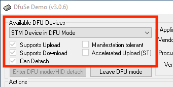
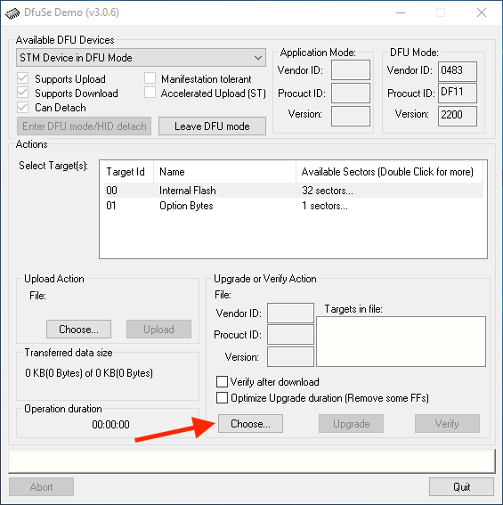
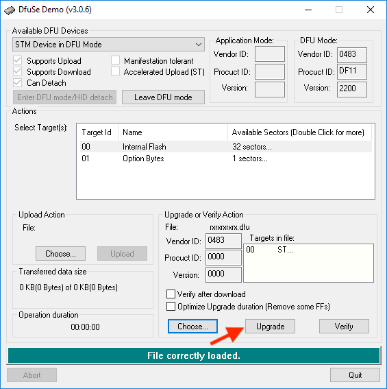
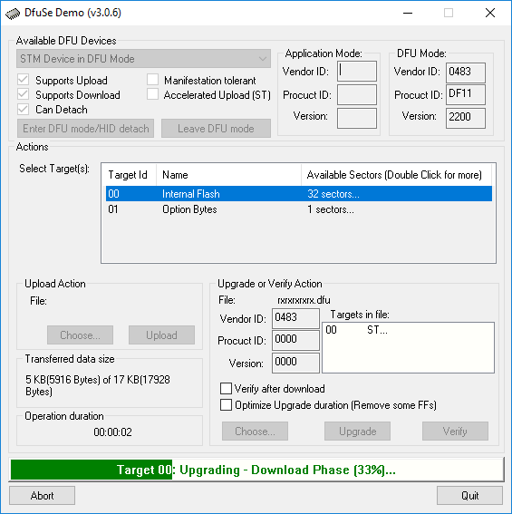

# Getting Started with duckypad

Congratulations on your new toy! Here is a short guide on how to use your duckypad.

## Quick Start

You need a micro SD card to store the scripts from which duckypad will execute. Any old ones would do.

Format it in FAT32, with `Default allocation size`:


Afterwards, [Click here](https://github.com/dekuNukem/duckypad/raw/master/sample_SD_card.zip) to download some sample profiles. Extract everything into the root of SD card:


Eject the SD card and insert it in duckypad. Logo side up, push inwards until it clicks in place:


Plug it in, and voilà:


* Press a key to execute the corresponding script. Hold it down to repeat.

* Use `+` and `-` button to switch profiles.

* To remove the SD card, push inwards to unlock.

## Customizing Your Own Scripts

Chances are you want to write your own profiles and scripts. So here's how! 

(don't forget you can always use [existing examples](https://github.com/dekuNukem/duckypad/raw/master/sample_SD_card.zip) as a starting point)

### Step 1: Preparing Profiles

Profiles are created as folders, with naming conventions like `profile#_name`, where `#` is the profile number, and `name` being the name of the profile. Here are some examples:


* Currently 16 profiles are supported

### Step 2: Preparing Scripts

Now you're ready to write some scripts inside the profile folders. The script used in this project is Duckyscript, [click here to read its usage](https://github.com/hak5darren/USB-Rubber-Ducky/wiki/Duckyscript).

Each key has its own script file, named like `key#_name.txt`, where `#` is the key number(top left is 1, bottom right is 15), and `name` is a short description of what that key does. 

Here are some examples:


* The screen will only display the **first 7 characters** of the key name, so keep it short!

* You can leave gaps in the key numbering (such as only defining key 1, 2, 6, 12, 15, etc)

### Step 3: Optional Parameters

Here are some optional settings you can adjust. You don't have to do it, but it will look better if you do.

Simply create a file named `config.txt` in a profile folder like this:


#### Backlight Colors

To set your custom backlight color, put the following lines **`AT THE BEGINNING`** of `config.txt`:

```
BG_COLOR 255 100 0
KEYDOWN_COLOR 100 0 255
```

BG_COLOR is the background color. The number should be between 0 and 255, in the order of R-G-B.

Similarly, KEYDOWN_COLOR is the color of the key when you press it down.

If you skip this step, the default backlight color would be light purple.

#### Dim Unused Keys

By default unused keys are dimmed. If you want everything to light up, add the following line in `config.txt`:

```
DIM_UNUSED_KEYS 0
```

#### Individual Key Colors

You can also assign colors to individual keys, this will override the background color above.

Just add lines for the keys you want in `config.txt` like this:

```
SWCOLOR_1 148 0 211
SWCOLOR_2 148 0 211
SWCOLOR_3 148 0 211
SWCOLOR_4 0 0 255
SWCOLOR_5 0 0 255
SWCOLOR_6 0 0 255
SWCOLOR_7 0 255 0
SWCOLOR_8 0 255 0
SWCOLOR_9 0 255 0
SWCOLOR_10 255 255 0
SWCOLOR_11 255 255 0
SWCOLOR_12 255 255 0
SWCOLOR_13 255 0  0
SWCOLOR_14 255 0  0
SWCOLOR_15 255 0  0
```

The above result in a pretty rainbow:


### Step 4: Run it!

Just like before, format the SD card in FAT32, put all the profile folders in the root of the SD card, and insert it in your duckypad.

duckypad should start up with the first profile, displaying the profile names and key names, as well as the background color.

Press the corresponding keys to execute their scripts, if there is an error it will show up on the screen.

Press +/- button to change profiles.

## Using Autohotkey

For even more extereme scripting needs, you can use [autohotkey](https://www.autohotkey.com) with duckyPad.

Check out the [official tutorials](https://www.autohotkey.com/docs_1.0/Tutorial.htm), the [autohotkey profile](https://github.com/dekuNukem/duckypad/raw/master/sample_SD_card.zip), and a [sample autohotkey script](resources/duckypad_autohotkey_script.ahk) upon which you can tinker with. 

## USB Firmware Updates

You can update duckypad's firmware via USB, for bug fixes and and/or new features. 

To do this, download and install the [STM32 DfuSe tool](resources/en.stsw-stm32080_stm32_DfuSe.zip) from this repo. You can download it from [the official website](https://www.st.com/en/development-tools/stsw-stm32080.html) too, but it requires creating an account.

First, locate the debug buttons on the board:


To update firmware:

* Make sure the board is OFF and unplugged.

* **Press and hold down the DFU button (one on the left)** while plugging it into a computer.

* Once it is plugged in, you can release the button.

If all went well, the backlight and display should stay off.

Now launch the `DfuSeDemo` software:


In the `Available DUF Devices` section at top left corner, you should see a `STM Device in DFU Mode`.



Press the `Choose...` button and select a firmware file in `.dfu` format. Make sure it's the correct file!

* [Click me](firmware/kbord.dfu) for latest firmware



Press `Upgrade` button to start uploading the new firmware into the microcontroller.



And now the firmware is being updated!



It could take anywhere between a few seconds to a few minutes. Try using different USB ports if it is particularly slow. 

After uploading is complete, unplug and plug it back in to start using the new firmware. 

## Pretty Colors

Under construction...
